## Spring Nubbin™ Exam Project Manager
Project developed using Spring Boot, this application is designed to manage projects, tasks, companies, and users. It leverages the Model-View-Controller (MVC) architecture, Spring Security for authentication and authorization, and Spring Data JPA for data operations. The application allows users to create and manage projects, assign tasks, collaborate with other users, and manage company-related data within the system.

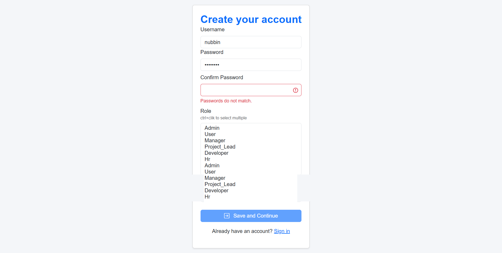
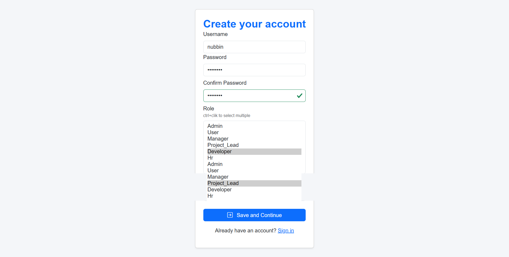

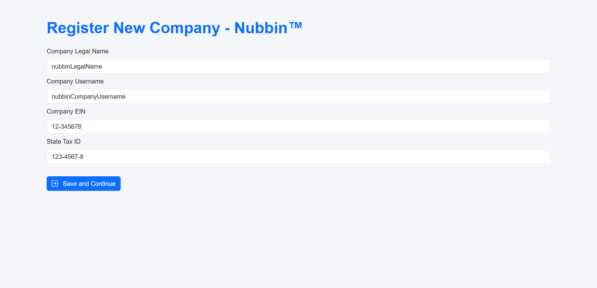

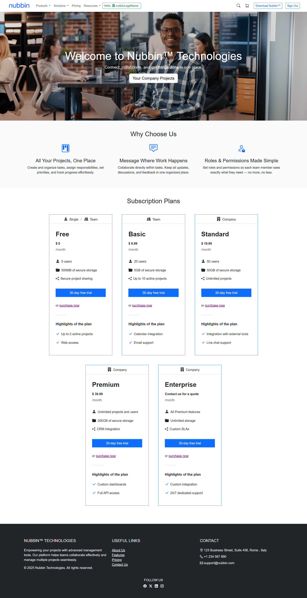
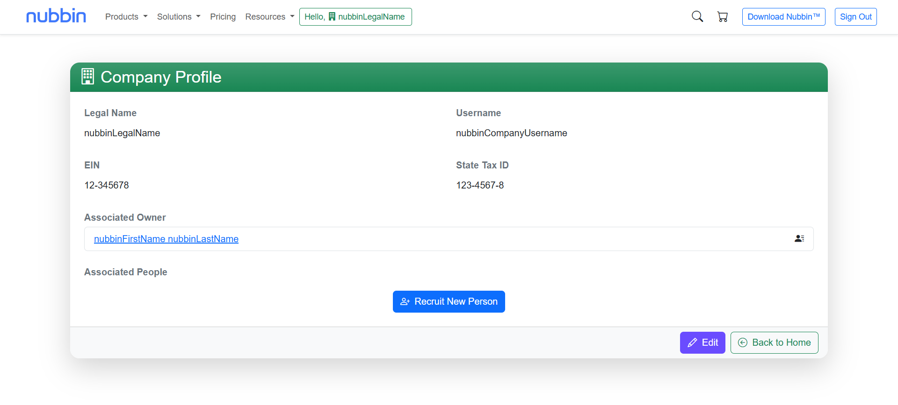

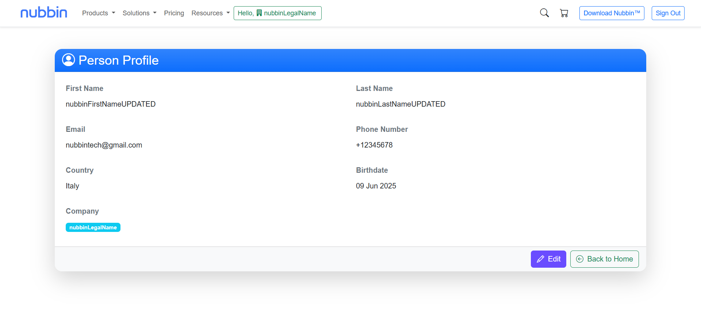
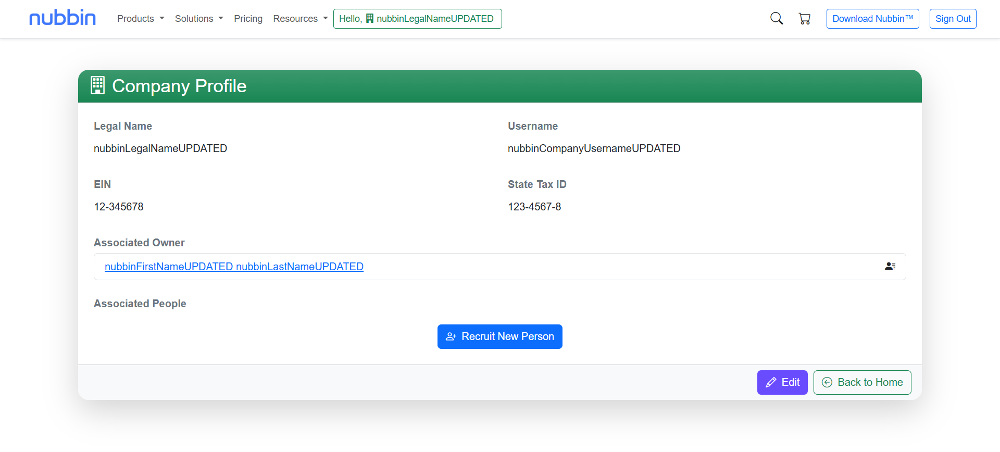
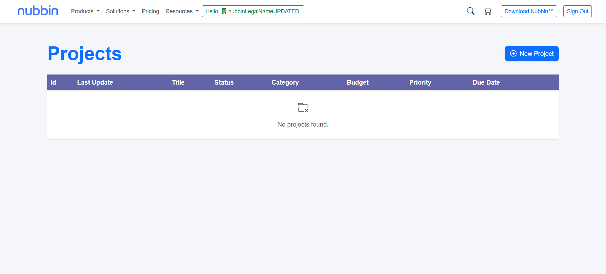
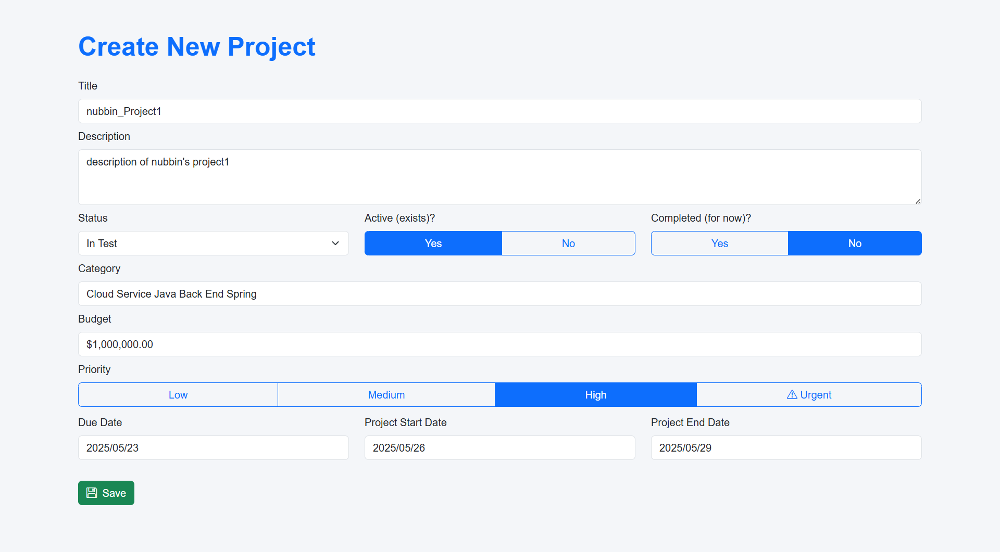
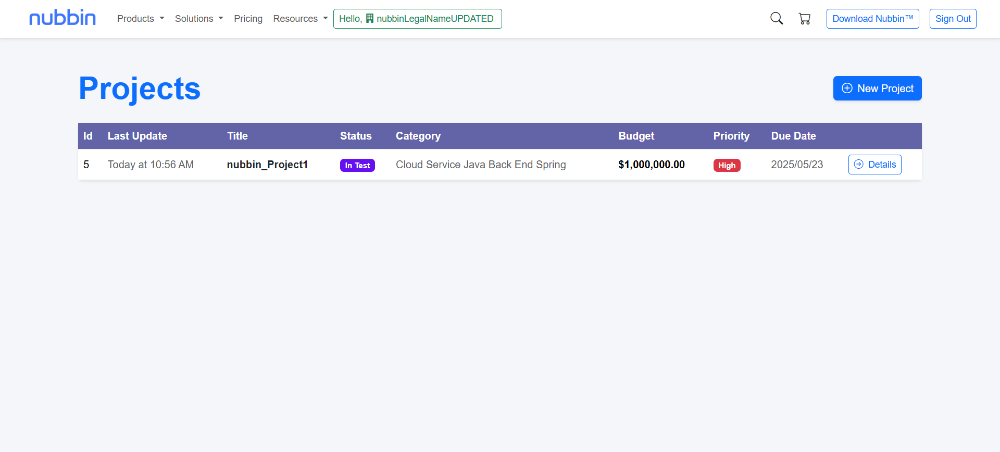
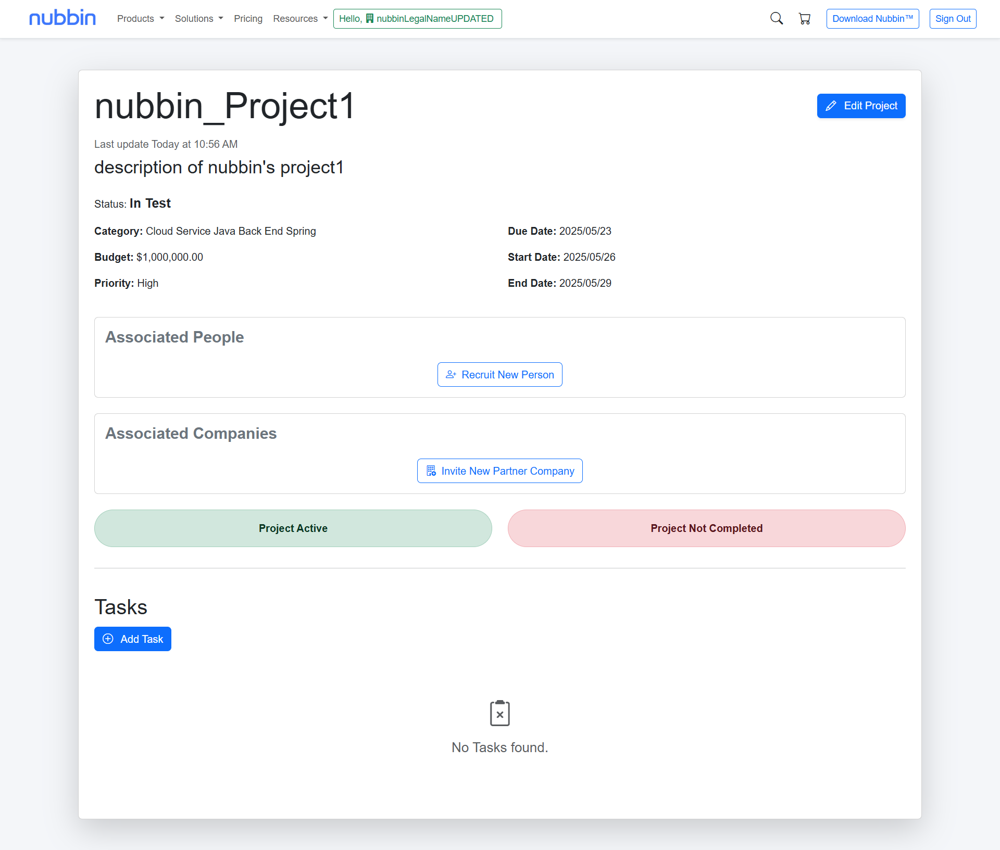
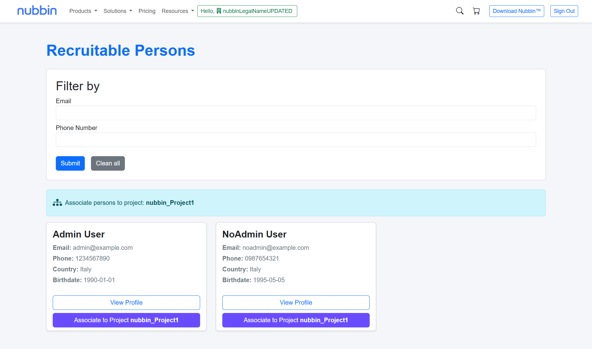
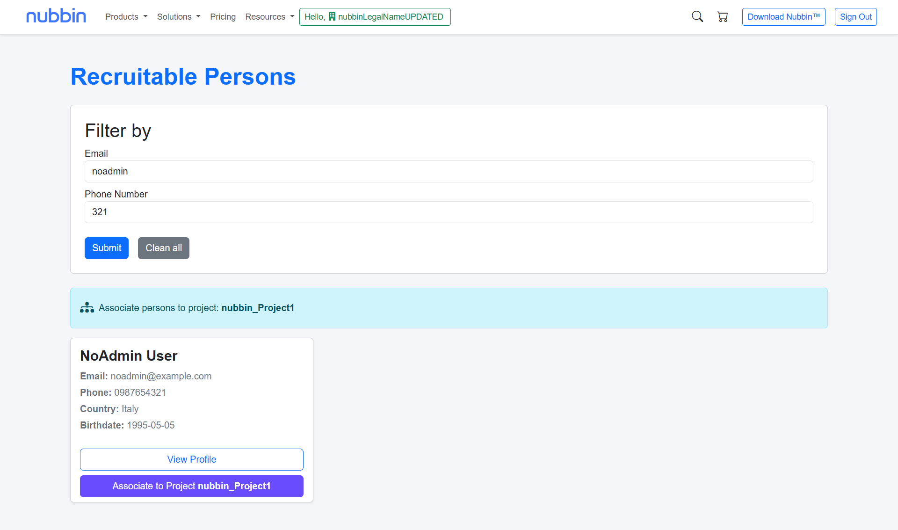
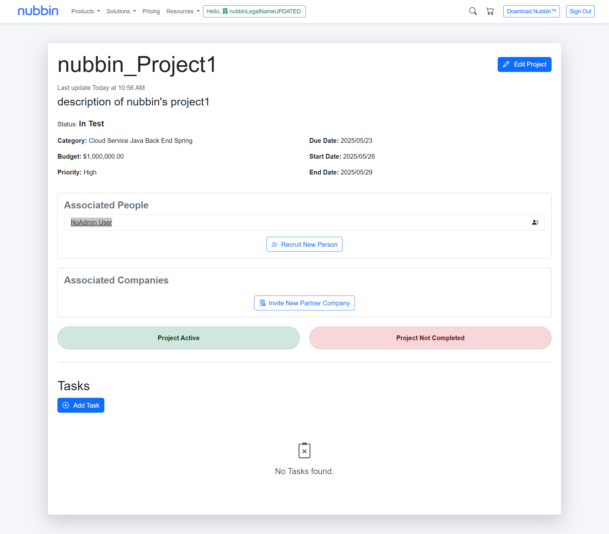
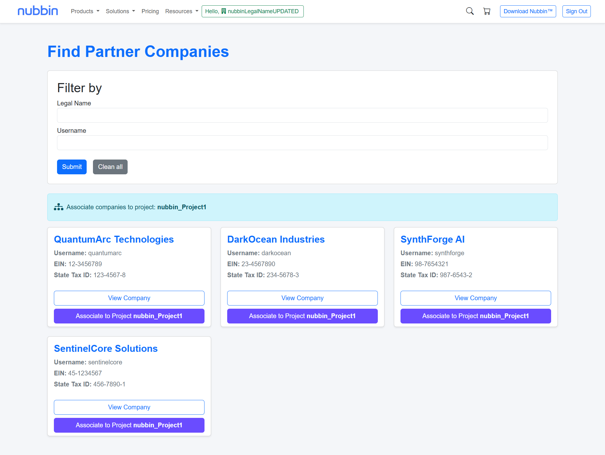
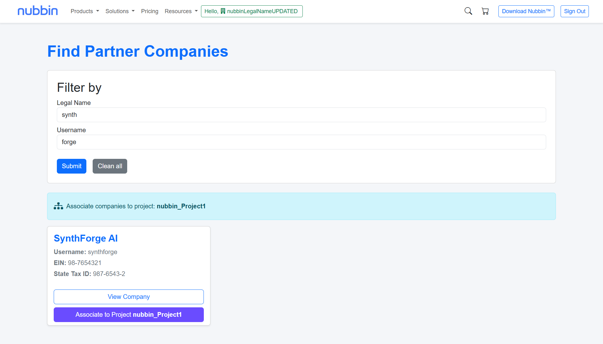
