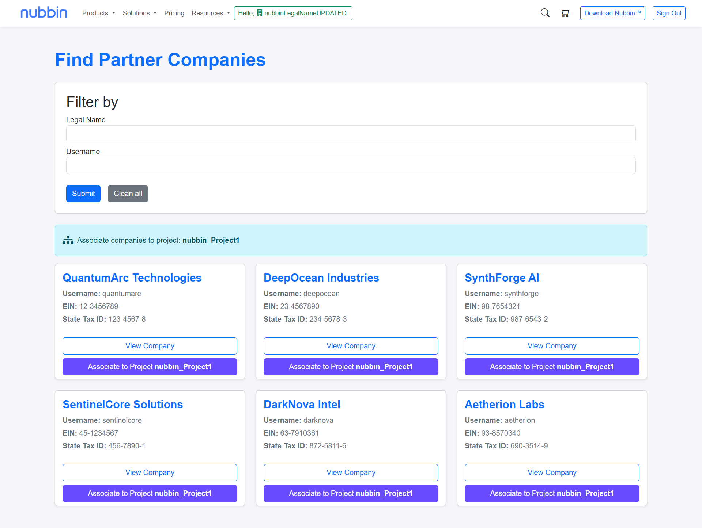
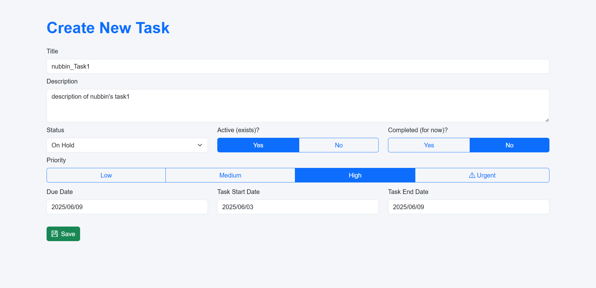
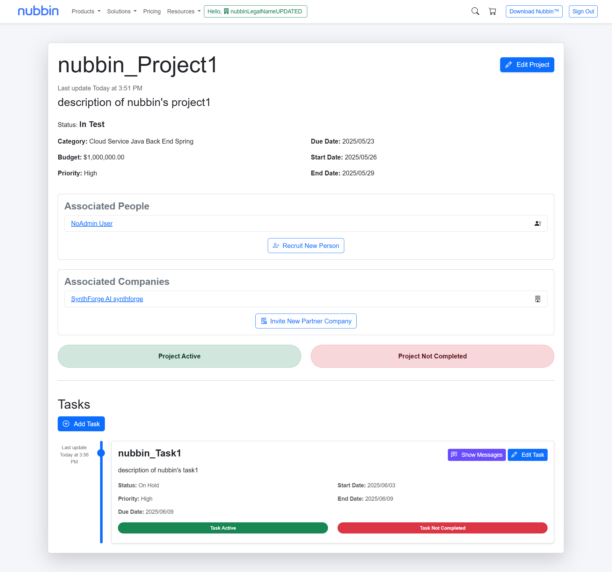
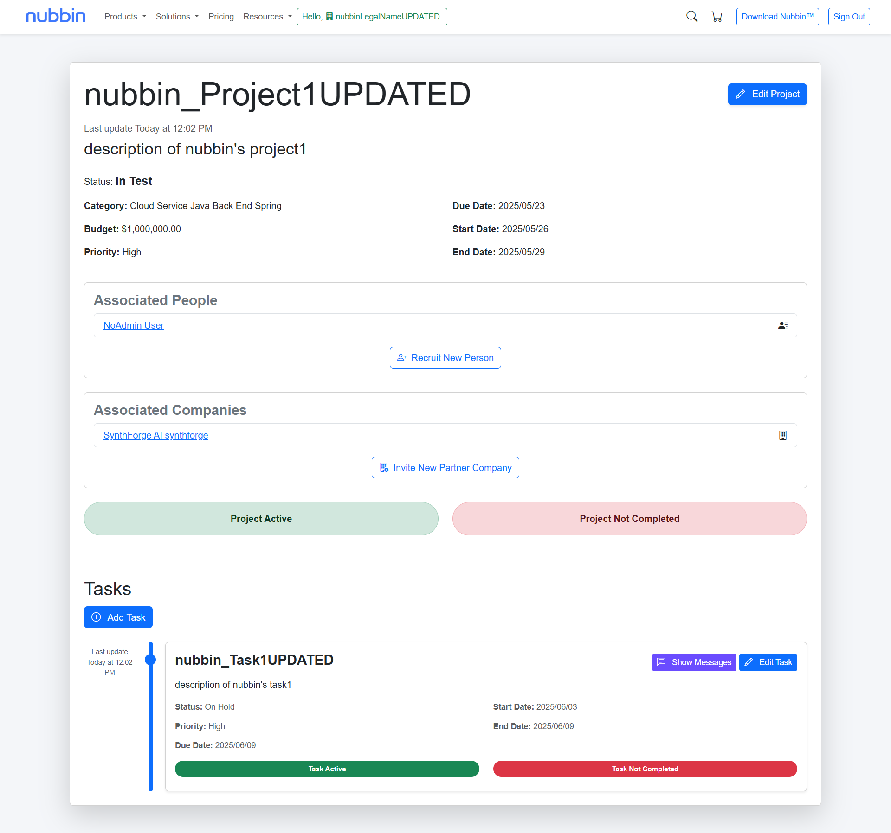
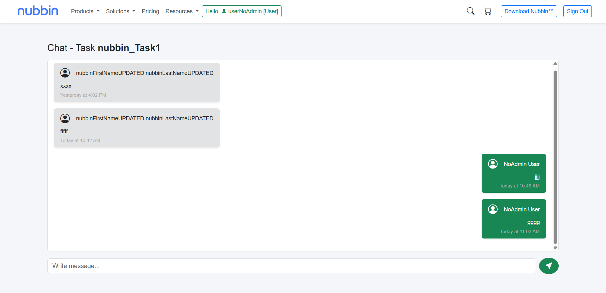
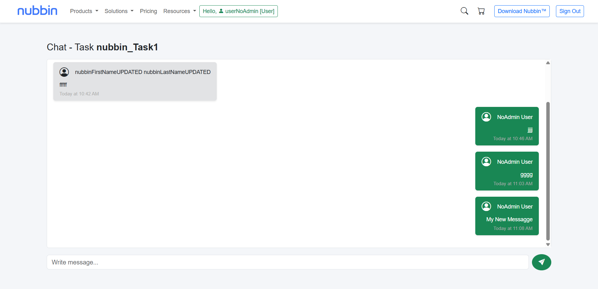

## Spring Nubbin™ Technologies Project Manager
Project developed using Spring Boot, this application offers a robust platform for managing collaborative projects across individuals and companies. It supports task assignment, messaging, and secure access control using Spring Security and method-level authorization. Built with an MVC architecture, it integrates Spring Data JPA for persistence and Thymeleaf for dynamic server-side rendering. Designed with scalability and future expansion in mind, the system supports subscription-based access, positioning it for potential evolution into a paid SaaS platform.

---

## 🛠️ Technologies Used

- **Spring Boot** – Backend framework
- **Spring Data JPA** – ORM and repository support
- **Spring Security** – Authentication and authorization
- **Thymeleaf** – Server-side templating engine
- **Maven** – Dependency management and build tool
- **MySQL** – Relational database

---

## 🌱 Seeder & Data Generation

A seeder class is included to pre-populate the database with fake data (companies, users, etc.) for testing and development purposes.

---

## 📦 Entities

- **User**: Used by Spring Security for authentication. Contains username, password, a list of roles, and a reference to a single `Person`
- **Role**: Defines system roles (`ADMIN`, `USER`, etc.)
- **Person**: Basic user profile info (name, etc.)
- **Company**: Represents an organization with persons
- **Client**: Represents clients with a subscription plan
- **Project**: A shared work unit that contains one or more tasks. It can involve multiple Persons (e.g., freelancers) and multiple Companies working together collaboratively
- **Task**: Assignable work items with progress tracking
- **Message**: Comments/messages related to a task (chat-style)

---

## 🔐 Security

The application uses Spring Security to manage authentication and authorization. Security is configured through a combination of annotations, custom logic, and role-based access control.

### Key Features
- **Custom Login Form**  
  The login page is available at `/security/sign-in`, and Spring Security handles the login process at `/sign-in`.
- **Custom UserDetailsService**  
  The app uses a custom `CustomUserDetailsService` that loads a User (which contains username, password, a list of Roles, and a linked Person entity).
- **Role-Based Authorization**  
  User roles (e.g., ADMIN, USER) are stored in the database and attached to each User. These roles can be used with `@PreAuthorize` to restrict access to controller methods.
- **Method-Level Security**  
  The application enables method-level security using `@EnableMethodSecurity`, allowing for fine-grained access control using annotations like @PreAuthorize.
- **SecurityService Component**  
  A central `SecurityService` class provides methods for checking entity-specific access permissions (e.g., hasAccessToProject, hasAccessToTask, etc.). This enables secure access enforcement using Spring Expression Language (SpEL) inside @PreAuthorize annotations.
- **@AuthenticationPrincipal & Authentication**  
  Controllers access the currently logged-in user via `@AuthenticationPrincipal CustomUserDetails customUserDetails` or `Authentication authentication`.

### Logout
Users can sign out via /sign-out. On logout, the session is invalidated and the user is redirected to `/`.

---

## 📡 API Endpoints

RESTful API controllers are provided for external systems to interact with projects, tasks, users, and other entities.
The API supports full **Create, Read, Update, and Delete (CRUD)** operations for all core entities.

---

## 💻 Getting Started

### Prerequisites

- Java 17 or later
- Maven
- MySQL running and accessible

### Environment Variables

You can define these in an `.env` file or export them:
```env
SPRING_DATASOURCE_USERNAME=your_db_username
SPRING_DATASOURCE_PASSWORD=your_db_password
```

### Main Dependencies

Grouped for clarity (see `pom.xml` for full list):

- **Spring Boot Starters**:
  - `spring-boot-starter-web`
  - `spring-boot-starter-data-jpa`
  - `spring-boot-starter-security`
  - `spring-boot-starter-validation`
  - `spring-boot-starter-thymeleaf`
- **Database**:
  - `mysql-connector-j`
- **Development Tools**:
  - `spring-boot-devtools`, `spring-boot-starter-test`
  - `spring-security-test`
- **UI/Frontend** (via WebJars):
  - `bootstrap`, `bootstrap-icons`
  - `dayjs`, `flatpickr`
- **Others**:
  - `thymeleaf-extras-springsecurity6`
  - `lombok`
  - `dotenv-java`
  - `datafaker`

---

## ▶️ Running the Application

```bash
# Clone the repository
git clone https://github.com/nelvison-benedetto/spring-exam-project-manager
cd spring-nubbin-project-manager

# Build the project
mvn clean install

# Run the application
mvn spring-boot:run
```











